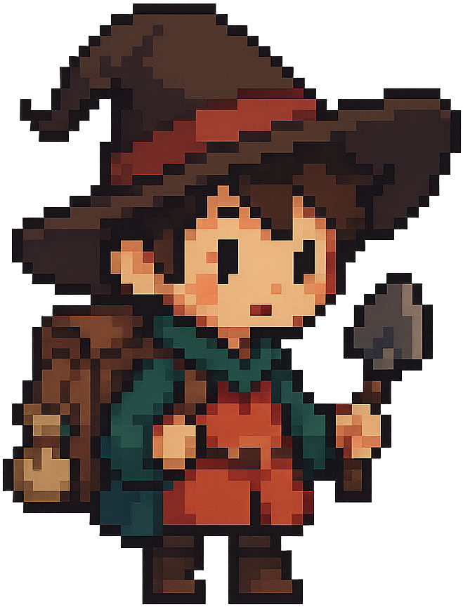
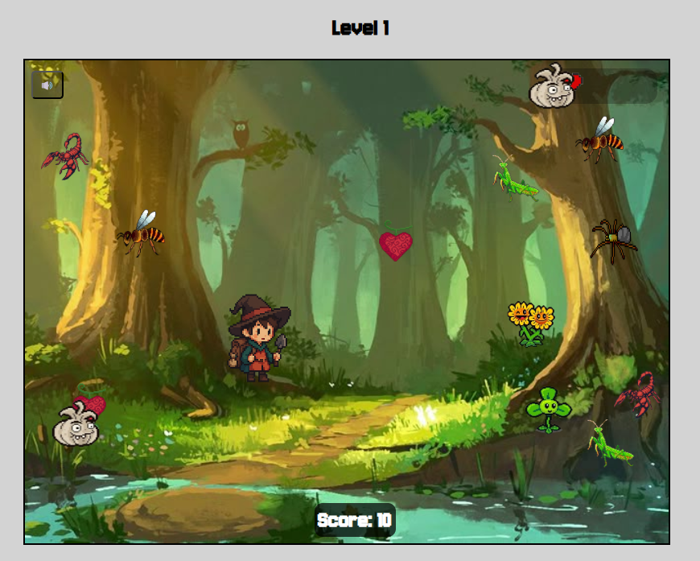
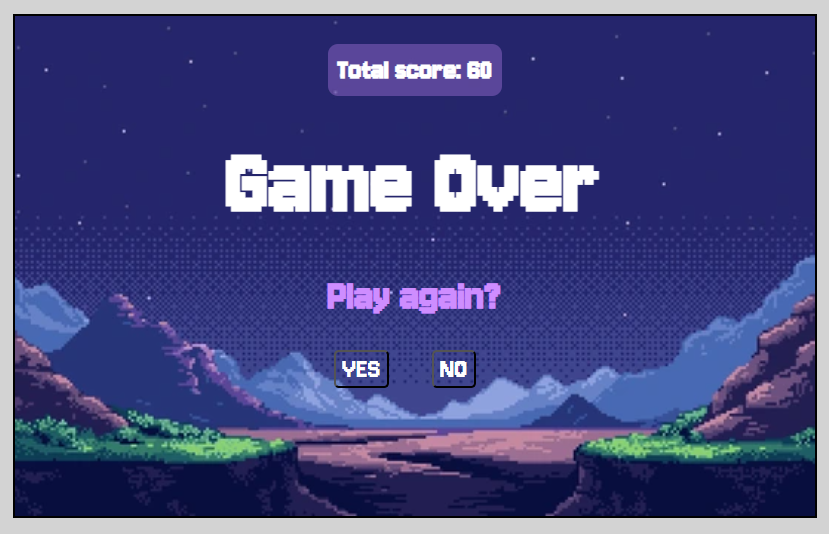

# BLOOM QUEST

## [Play the Game!](https://mariajs99.github.io/Bloom-Quest/)

# Description

 Bloom Quest is a PC game where you play as a collector who crafts potions using magical ingredients found in an enchanted forest. You can move freely across the screen, collecting cute magical fruits and vegetables that appear randomly and vanish after a few seconds. While gathering ingredients, you must avoid insects entering from the right side. Occasionally, a special bonus fruit will appear, granting temporary immunity and a speed boost. As time passes, the game becomes more challenging, with both insects and the player moving faster. The game ends when you loose all your lives.
 
 

 

# Main Functionalities (also DOM)

- Smooth movement: The player moves smoothly across the screen using WASD keys, including diagonal movement.
- Ingredient collection: Ingredients appear randomly and disappear after a few seconds. The player must collect them quickly.
- Avoid enemies: Insects appear from the right and must be avoided.
- Lifes system: Colliding with an insect reduces one life (you have 3 in total). You can see the remaining lives in the upper right corner of the screen.
- Bonus fruit: it gives you temporary immunity, and speed boost.
- Score system: Player collects ingredients to increase score (+10 points). Bonus fruit increases the score to +30. Score is updated at the botton of the screen.
- Difficulty scaling: Game difficulty increases over time (faster enemies and player). You can know which level you are in at the top of the screen.
- Game Over: When the lives reach 0, the Game Over screen appears with a reset button and a button to return to the home screen.
- Music and sound effects: Background music is added to the game, along with sound effects triggered by collisions and button presses.

 

   
 

 This is the Recollector when takes the bonus.

 

# Backlog Functionalities

- Player ranking system: Add a ranking system to display the top 5 players with the highest scores.
- Life recovery: Implement a feature where collecting a bonus fruit can restore one life if the player has lost any.
- Sound control button: Add a button to control sound settings, not only to the background music.
- Enemy scaling: As difficulty increases, introduce more enemies on the screen.

# Technologies used

- HTML5
- CSS3
- JavaScript
- DOM manipulation
- JS Classes
- JS Audio() and JS Image()

# States

- Start Screen

- Game Screen

- Game Over Screen

 
 

# Proyect Structure

## main.js

- DOM elements manipulation
- Global game variables
- Functions: 
    - startGame();
    - gameLoop();
    - colision();
    - perderVida();
    - activarBonus();
    - aumentarDificultad();
    - actualizarNivelVisual();
    - gameOver();
    - limpiarJuego();
    - reiniciarJuego();
- Event Listeners

## main-character.js 

- class Recolector() {
    this.node;
    this.node.src;
    this.x;
    this.y;
    this.w;
    this.h;
    this.speed;

    this.node.style.width;
    this.node.style.height;
    this.node.style.left;
    this.node.style.top;
    this.node.style.position;

}
- moverRecolector (direction) {}
- class Vidas () {
    this.vidas;
}

## bichos.js 

- class Bichos() {
    this.node;
    this.node.src;
    this.x;
    this.y;
    this.w;
    this.h;
    this.speed;

    this.node.style.width;
    this.node.style.height;
    this.node.style.left;
    this.node.style.top;
    this.node.style.position;

}
- movimientoBichos() {}
- bichosEstaFuera() {}
- desapareceBicho() {}

## ingredientes.js 

- class Ingredientes() {
    this.node;
    this.node.src;
    this.x;
    this.y;
    this.w;
    this.h;
    this.speed;

    this.node.style.width;
    this.node.style.height;
    this.node.style.left;
    this.node.style.top;
    this.node.style.position;

    setTimeOut()
}
- desapareceIngrediente() {}

## fruta-bonus.js 

- class FrutaBonus() {
    this.node;
    this.node.src;
    this.x;
    this.y;
    this.w;
    this.h;
    this.speed;

    this.node.style.width;
    this.node.style.height;
    this.node.style.left;
    this.node.style.top;
    this.node.style.position;

    setTimeOut()
}
- desapareceFrutaBonus() {}

# Extra Links 

### Sketch
[Link](https://excalidraw.com/)

### Slides
[Link](www.your-slides-url-here.com)

## Git
- [Link Repo](https://github.com/mariajs99/Bloom-Quest.git)
- [Link Deploy](https://mariajs99.github.io/Bloom-Quest/)

